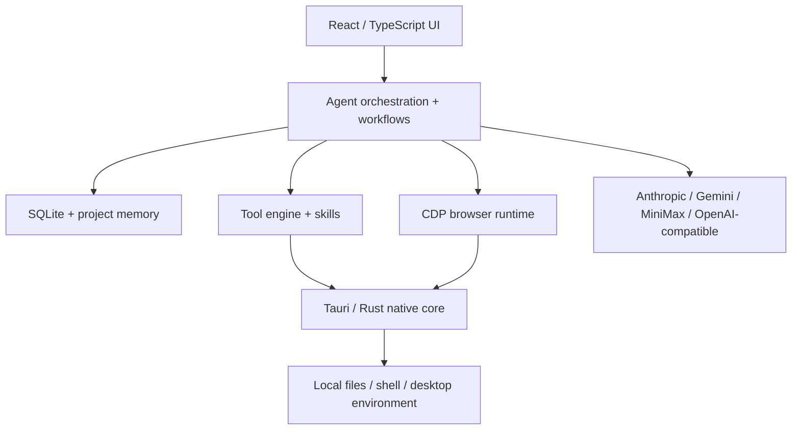

<div align="center">

# Pipi-Shrimp Agent · 皮皮虾助手

**A local-first AI desktop agent that can actually use your computer tools.**

Tauri + Rust + React/TypeScript · Multi-provider LLMs · Tool calling · Browser automation · Workflows · Memory · Multi-agent orchestration

[Website](https://pipi-shrimp-agent.vercel.app) · [Architecture](website) · [License](LICENSE)

</div>

---

## Why Pipi-Shrimp exists

Most AI chat apps stop at text. Pipi-Shrimp is built around the layer after the model response: **tools, state, recovery, permissions, workflows, and local execution**.

It is a desktop agent runtime for people who want one place to connect multiple LLM providers with real developer and productivity tools while keeping project context local.

```text
Prompt / task
    ↓
LLM provider
    ↓
Agent orchestration
    ↓
Tools · browser · workflows · skills
    ↓
Local files · shell · projects · documents
```

## What it can do

- **Multi-provider LLM runtime** — Anthropic, Gemini, MiniMax, and OpenAI-compatible endpoints with streaming and tool calls.
- **Local tool execution** — Bash, Python, Node.js, file operations, grep/glob, REPL, SSH, LSP, and more.
- **Browser automation** — CDP-based browser control with persisted failure recovery and manual-takeover paths.
- **Visual workflows** — multi-step execution with sequential, parallel, and conditional routing.
- **Project memory** — SQLite-backed conversations plus workspace-level long-term context in `.pipi-shrimp/core.md`.
- **Multi-agent collaboration** — team-style agents with task delegation, async inboxes, permissions, and transcripts.
- **Context compression** — microcompact, session memory, and full-summary layers for long-running sessions.
- **AutoResearch** — conversational bootstrap plus iterative experiment workflows for research-oriented tasks.
- **Document skills** — Typst-backed PDF/SVG rendering and built-in skills for common document workflows.
- **Remote access** — Telegram integration for controlling the agent away from the desktop.

## Architecture



The Rust backend keeps native IPC, persistence, provider transport, browser integration, and lower-level system operations separate from the React application layer.

## Reliability work that matters

Pipi-Shrimp is intentionally built beyond the happy-path demo:

- provider-specific request/response adapters
- retry and error normalization
- buffered SSE parsing
- cancellation support
- SQLite WAL mode and migration backups
- database health / restore tooling
- browser-failure recovery snapshots
- explicit permission configuration for native capabilities

These are the parts that make an agent usable for real projects instead of only impressive in a short demo.

## Quick start

### Requirements

- Node.js 18+ (24+ recommended)
- pnpm
- Rust toolchain
- Tauri platform prerequisites

### Run locally

```bash
git clone https://github.com/mammut001/pipi-shrimp-agent.git
cd pipi-shrimp-agent
pnpm install
pnpm run tauri:dev
```

### Build

```bash
pnpm run tauri:build
```

## Project layout

```text
src/
├── components/        UI and workflow surfaces
├── pages/             Chat, Workflow, Skills, AutoResearch, Diagnostics
├── services/          orchestration, memory, swarm, compact, workflows
├── skills/            document and utility skills
├── tools/             local tool implementations
└── store/             frontend state

src-tauri/
├── src/claude/        multi-provider HTTP + streaming adapters
├── src/browser/       CDP browser automation
├── src/mcp/           MCP client / transport
├── src/tools/         native tool pipeline
├── src/database.rs    SQLite persistence
└── capabilities/      Tauri permission configuration
```

## Current focus

The project is currently pushing deeper into three areas:

1. **Agent reliability** — recovery, cancellation, persistence, provider compatibility.
2. **Local computer use** — useful automation without turning the app into an unrestricted remote-control surface.
3. **Research workflows** — AutoResearch bootstrap, experiment loops, and reproducible project context.

## Tech stack

**Frontend:** React 18 · TypeScript · Vite · Tailwind · Zustand  
**Native backend:** Rust · Tauri 2 · Tokio · Rusqlite  
**Automation:** Chromiumoxide / CDP · local tools · MCP  
**Documents:** Typst  
**AI:** Anthropic · Gemini · MiniMax · OpenAI-compatible APIs

## Documentation

- [Project website / architecture](website)
- [Previous long-form README reference](README.full.md)
- Source modules include implementation notes and integration tests for the provider, browser, workflow, memory, and database paths.

## License

Apache License 2.0 — see [LICENSE](LICENSE).

---

<div align="center">

If this is the kind of local AI tooling you want to see grow, consider starring the repo. ⭐

</div>
